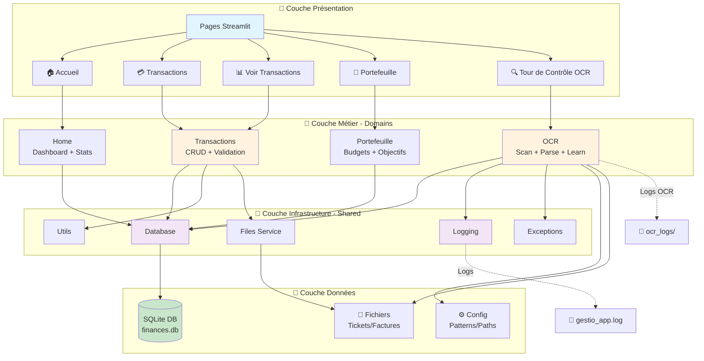
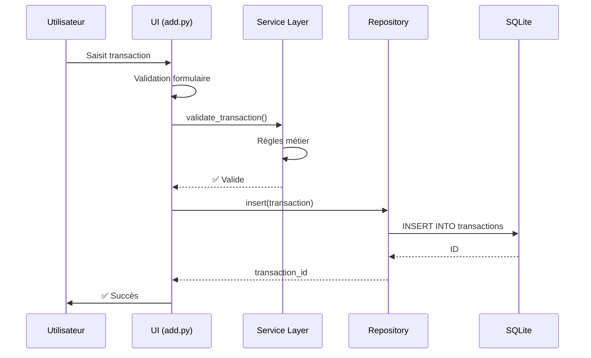
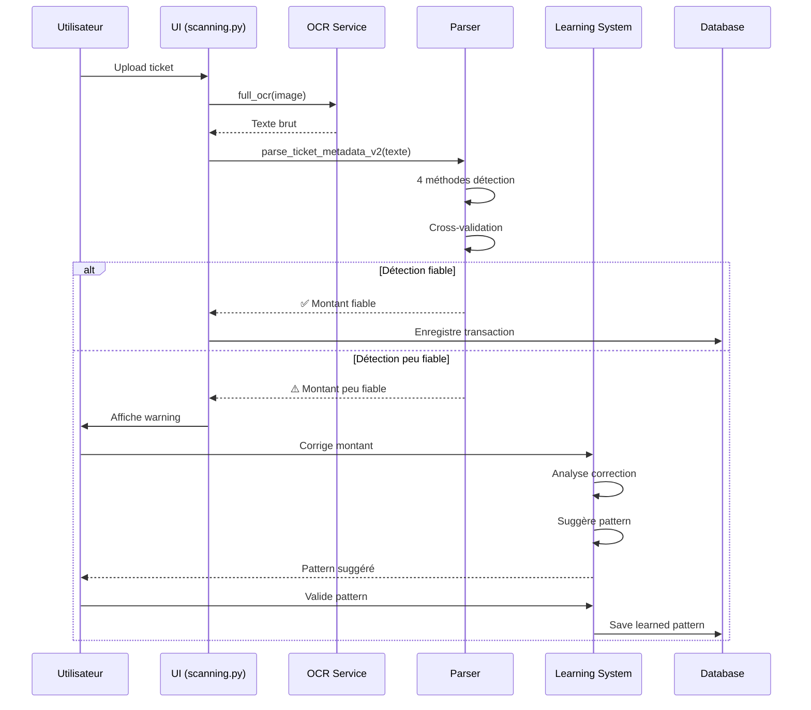

# Architecture - Gestio V4

**Diagramme principal** - Vue d'ensemble complète du système

---

## 📊 Architecture Globale



---

## 🗂️ Structure Dossiers

```
gestion-financière/
├── v4/                          ← Application principale
│   ├── main.py                  ← Point d'entrée Streamlit
│   ├── config/                  ← Configuration
│   │   ├── __init__.py
│   │   ├── paths.py             ← Chemins (TEST_MODE)
│   │   ├── ocr_patterns.yml     ← Patterns détection
│   │   └── ocr_patterns_learned.yml
│   ├── domains/                 ← Business Logic (DDD)
│   │   ├── ocr/                 ← Module OCR
│   │   ├── transactions/        ← Module Transactions
│   │   ├── home/                ← Module Home  
│   │   └── portefeuille/        ← Module Portefeuille
│   ├── shared/                  ← Infrastructure partagée
│   │   ├── logging_config.py    ← Logging centralisé
│   │   ├── exceptions.py        ← Exceptions custom
│   │   ├── database.py          ← DB connection
│   │   ├── utils.py             ← Helpers
│   │   ├── ui.py                ← Composants UI
│   │   └── services/
│   │       └── files.py         ← Gestion fichiers
│   └── tests/                   ← Tests (43 total)
│       ├── test_ocr/            ← Tests OCR (20)
│       ├── test_shared/         ← Tests Utils (8)
│       └── test_integration/    ← Tests intégration (15)
│
├── bibliotheque/                ← Documentation centralisée
│   ├── INDEX.md                 ← Navigation principale
│   ├── ARCHITECTURE.md          ← Ce fichier
│   ├── guides/                  ← Guides généraux
│   ├── modules/                 ← Règles par module
│   ├── readmes/                 ← Résumés modules
│   ├── ajouts/                  ← Historique modifications
│   ├── erreurs/                 ← Erreurs documentées
│   └── help/                    ← Guides externes
│
└── data/                        ← Données (gitignored)
    ├── finances.db              ← Base production
    ├── logs/                    ← Logs app
    │   └── gestio_app.log
    ├── ocr_logs/                ← Logs OCR
    │   ├── scan_history.jsonl
    │   ├── performance_stats.json
    │   └── pattern_stats.json
    ├── tickets_a_scanner/       ← Input OCR
    ├── tickets_tries/           ← Tickets scannés
    └── exports/                 ← Exports CSV
```

---

## 🔄 Flux Données Principal

### Workflow Transaction Manuelle



### Workflow OCR Complet



---

## 🎯 Patterns Architecture

### 1. **Domain-Driven Design (DDD)**

```
domains/
├── ocr/          ← Domaine métier OCR
├── transactions/ ← Domaine métier Transactions
└── home/         ← Domaine métier Dashboard
```

**Chaque domaine** = Logique métier isolée

### 2. **Repository Pattern**

```python
# Data Access encapsulé
class TransactionRepository:
    @staticmethod
    def get_all() -> pd.DataFrame:
        conn = get_db_connection()
        # SQL ici seulement
```

**Avantages** :
- UI ne touche jamais SQL directement
- Tests faciles (mock repository)
- Changement DB facile

### 3. **Service Layer**

```python
# Business Logic
class TransactionService:
    def validate_transaction(trans):
        # Règles métier
```

**Séparation** : UI → Service → Repository → DB

### 4. **Dependency Injection**

```python
# Modules dépendent de shared/
from shared.logging_config import get_logger
from shared.exceptions import ValidationError
```

**Flux** : domains/ → shared/ → config/

**Jamais** : shared/ → domains/ ❌

---

## 📦 Modules Principaux

### 1. **OCR** (domains/ocr/)

**Rôle** : Extraction données tickets/factures

**Composants** :
- `scanner.py` - OCR Tesseract
- `parsers.py` - Analyse texte (4 méthodes)
- `learning_service.py` - Apprentissage auto 🧠
- `logging.py` - Logs OCR

**Patterns** : 52 actifs  
**Taux succès** : 85-95%

### 2. **Transactions** (domains/transactions/)

**Rôle** : Gestion CRUD transactions

**Composants** :
- `models.py` - Transaction dataclass
- `repository.py` - Data access
- `services.py` - Business logic
- Pages UI (add, view, edit)

**Tests** : 6 intégration

### 3. **Shared** (shared/)

**Rôle** : Infrastructure commune

**Composants** :
- `logging_config.py` - Logging centralisé
- `exceptions.py` - 6 exceptions custom
- `database.py` - Connection DB
- `utils.py` - 30+ helpers
- `ui.py` - Composants réutilisables

### 4. **Config** (config/)

**Rôle** : Configuration centralisée

**Composants** :
- `paths.py` - Chemins fichiers
- `database_config.py` - Config DB
- `ocr_config.py` - Config OCR
- `ui_config.py` - Config UI

**README** : [config/README.md](../v4/config/README.md)

---

## 📦 Dépendances Python par Module

### Table Complète des Dépendances

| Module | Bibliothèque | Utilisation | Version Min | Critique |
|--------|--------------|-------------|-------------|----------|
| **OCR** | `pytesseract` | Extraction texte OCR | ≥0.3.0 | ✅ |
| | `opencv-python-headless` | Traitement d'images | ≥4.0.0 | ✅ |
| | `Pillow` | Manipulation d'images | ≥8.0.0 | ✅ |
| | `pdfminer.six` | Extraction texte PDF | ≥20220524 | ✅ |
| | `regex` | Patterns avancés | ≥2020.0.0 | ⚠️ |
| **Home** | `streamlit` | Interface utilisateur | ≥1.0 | ✅ |
| | `pandas` | Manipulation de données | ≥1.3 | ✅ |
| | `plotly` | Graphiques interactifs | ≥5.0 | ✅ |
| **Portfolio** | `streamlit` | Interface utilisateur | ≥1.0 | ✅ |
| | `pandas` | Manipulation de données | ≥1.3 | ✅ |
| | `plotly` | Graphiques interactifs | ≥5.0 | ✅ |
| | `python-dateutil` | Calculs de dates | ≥2.8 | ✅ |
| **Transactions** | `streamlit` | Interface utilisateur | ≥1.0 | ✅ |
| | `pandas` | Manipulation de données | ≥1.3 | ✅ |
| **Revenues** | `streamlit` | Interface utilisateur | ≥1.0 | ✅ |
| **Shared/Services** | `python-dateutil` | Calculs de dates | ≥2.8 | ✅ |
| | `pandas` | Manipulation de données | ≥1.3 | ✅ |
| | `streamlit` | Session state | ≥1.0 | ✅ |
| | `regex` | Patterns avancés | ≥2020.0.0 | ⚠️ |
| **Shared/UI** | `streamlit` | Framework UI | ≥1.0 | ✅ |
| | `pandas` | Manipulation de données | ≥1.3 | ✅ |
| | `Pillow` | Traitement d'images | ≥8.0 | ✅ |
| **Shared/Utils** | `pandas` | Manipulation de données | ≥1.3 | ✅ |
| | `python-dateutil` | Parsing dates | ≥2.8 | ✅ |
| | `regex` | Patterns avancés | ≥2020.0.0 | ⚠️ |
| **Shared/Database** | `sqlite3` | Base de données | Standard Python | ✅ |

**Commande d'installation complète** :
```bash
pip install streamlit pandas plotly python-dateutil pytesseract opencv-python-headless Pillow pdfminer.six regex requests
```

### Prérequis Système

**Tesseract OCR** (requis pour module OCR) :
- **Windows** : Inclus dans le package portable
- **Linux** : `sudo apt install tesseract-ocr tesseract-ocr-fra`
- **macOS** : `brew install tesseract tesseract-lang`

**Langues OCR** : Fra + Eng (pour tickets bilingues)

---

## 🗄️ Base de Données

### Tables Principales

```sql
-- Transactions
transactions (
    id, type, categorie, sous_categorie,
    montant, date, description, source
)

-- Récurrences
recurrences (
    id, type, categorie, montant,
    date_debut, date_fin, frequence
)

-- Budgets
budgets_categories (
    id, categorie, budget_mensuel
)

-- Objectifs
objectifs_financiers (
    id, titre, montant_cible, type_objectif
)

-- Échéances
echeances (
    id, type, categorie, montant,
    date_echeance, type_echeance
)
```

---

## 🧪 Tests

```
tests/
├── test_ocr/              (20 tests)
│   ├── test_pattern_manager.py
│   └── test_parsers.py
├── test_shared/           (8 tests)
│   └── test_utils.py
└── test_integration/      (15 tests)
    ├── test_transaction_workflows.py
    └── test_ocr_learning.py
```

**Total** : 43 tests  
**Coverage** : ~85%

---

## 🚀 Phases Projet

### ✅ Phase 1 : Infrastructure (100%)
- Logging centralisé
- Exceptions personnalisées
- Tests unitaires

### ✅ Phase 2 : OCR (100%)
- 4 méthodes détection
- Système apprentissage
- Tests intégration

### 🔜 Phase 3 : Packaging
- PyInstaller
- Executable Windows
- Distribution

---

## 🔗 Liens Documentation

### Architecture et Guides

- [Règles implémentation](guides/IMPLEMENTATION_GUIDE.md)
- [Erreurs courantes](guides/COMMON_ERRORS.md)

### README Modules v4

**Domains** :
- [domains/home](../v4/domains/home/README.md) - Page d'accueil et dashboard
- [domains/ocr](../v4/domains/ocr/README.md) - Module OCR (extraction tickets)
- [domains/portfolio](../v4/domains/portfolio/README.md) - Gestion portefeuille
- [domains/revenues](../v4/domains/revenues/README.md) - Traitement revenus
- [domains/transactions](../v4/domains/transactions/README.md) - Gestion transactions

**Shared** :
- [shared/database](../v4/shared/database/README.md) - Gestion base de données SQLite
- [shared/services](../v4/shared/services/README.md) - Services partagés
- [shared/ui](../v4/shared/ui/README.md) - Composants UI réutilisables
- [shared/utils](../v4/shared/utils/README.md) - Fonctions utilitaires

**Configuration** :
- [config](../v4/config/README.md) - Configuration complète de l'application
- [resources](../v4/resources/README.md) - Ressources statiques (CSS)

### Historique

- [Ajouts chronologiques](ajouts/)
- [Erreurs documentées](erreurs/)

---

**Dernière mise à jour** : 23 décembre 2024  
**Version** : 4.0  
**Status** : Production-ready 95% ✅

> 📦 **Note importante** : Tous les modules documentent maintenant leurs dépendances explicitement dans leurs README respectifs. Consultez la table des dépendances ci-dessus ou les README individuels pour plus de détails.
