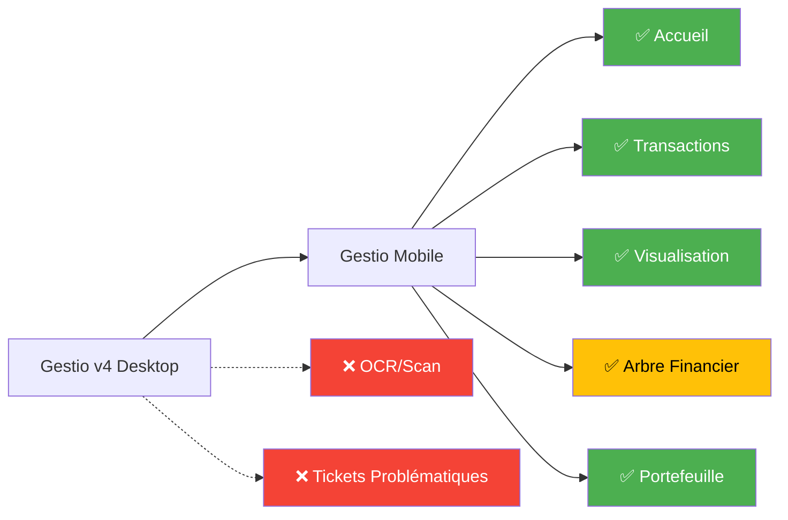
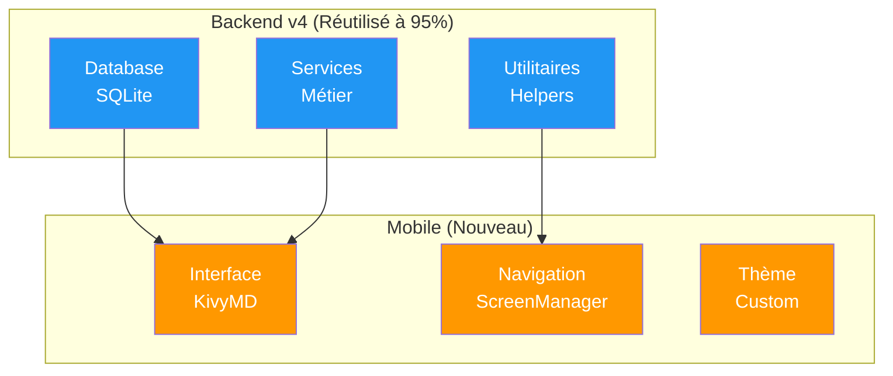
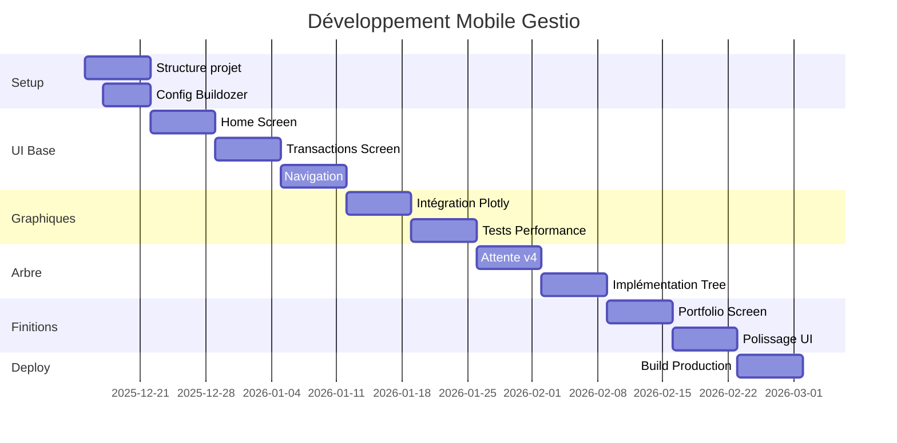

# 📱 Plan d'Adaptation Mobile - Gestio v4

> **Version** : 2.0 (Corrigée)  
> **Date** : 10 Décembre 2025  
> **Statut** : 🟡 En attente de finalisation v4  
> **Plateforme cible** : Android & iOS

---

## 🎯 Vue d'Ensemble

### Objectif
Porter l'application **Gestio v4** sur mobile (Android/iOS) avec **Kivy/KivyMD**, en réutilisant au maximum le backend existant et en créant une interface mobile native optimisée.

### Périmètre Fonctionnel



**Légende** :
- 🟢 **Inclus** : Fonctionnalités portées sur mobile
- 🟡 **En cours** : Composant en finalisation dans v4
- 🔴 **Exclus** : Réservé aux utilisateurs desktop existants

---

## 📊 Architecture Technique

### Stratégie de Réutilisation



### Stack Technique

| Couche | Desktop (v4) | Mobile | Status |
|:-------|:-------------|:-------|:-------|
| **Interface** | Streamlit | Kivy + KivyMD | 🔄 Nouveau |
| **Database** | SQLite | SQLite | ✅ Inchangé |
| **Services** | Python modules | Python modules | ✅ Réutilisé |
| **Graphiques** | Plotly (HTML) | WebView ou Static | 🔄 À adapter |
| **Stockage** | `~/analyse/` | App Storage | 🔄 À adapter |

---

## 🏗️ Structure du Projet

### Arborescence Cible

```
gestion-financière/
├── v4/                           # ✅ Backend existant (réutilisé)
│   ├── modules/
│   │   ├── database/            # Models, Repositories, Schema
│   │   ├── services/            # Logique métier
│   │   └── utils/               # Helpers partagés
│   └── config/
│       └── paths.py             # Chemins desktop
│
└── vmobile/                      # 🆕 Application mobile
    ├── main.py                   # Point d'entrée Kivy
    │
    ├── config/
    │   ├── paths_mobile.py       # Chemins adaptés (Android/iOS)
    │   └── logging_config.py     # Logs mobiles
    │
    ├── ui/
    │   ├── app.py                # Application Kivy
    │   ├── theme.py              # Thème KivyMD
    │   │
    │   ├── screens/              # 🖼️ 5 écrans principaux
    │   │   ├── home_screen.py
    │   │   ├── transactions_screen.py
    │   │   ├── view_transactions_screen.py
    │   │   ├── tree_screen.py
    │   │   └── portfolio_screen.py
    │   │
    │   └── components/           # 🧩 Composants réutilisables
    │       ├── charts.py
    │       ├── tree_widget.py
    │       └── transaction_card.py
    │
    └── buildozer.spec            # Configuration de build
```

---

## 🔧 Implémentation Détaillée

### 1️⃣ Configuration des Chemins Mobile

**Fichier** : [vmobile/config/paths_mobile.py](file:///c:/Users/djabi/gestion-financière/vmobile/config/paths_mobile.py)

**Problème** : Les chemins `~/analyse/` ne fonctionnent pas sur Android/iOS

**Solution** :
```python
import sys
import os
from pathlib import Path

def get_data_dir():
    """Retourne le répertoire selon la plateforme."""
    if sys.platform == 'android':
        from android.storage import app_storage_path
        return app_storage_path()
    elif sys.platform == 'ios':
        from pyobjus import autoclass
        NSSearchPath = autoclass('Foundation').NSSearchPathForDirectoriesInDomains
        return str(NSSearchPath(9, 1, True)[0])  # Documents directory
    else:
        return str(Path.home() / "analyse")

DATA_DIR = get_data_dir()
DB_PATH = os.path.join(DATA_DIR, "finances.db")
os.makedirs(DATA_DIR, exist_ok=True)
```

---

### 2️⃣ Écrans Mobiles

#### 🏠 Home Screen - Dashboard

**Fichier** : `vmobile/ui/screens/home_screen.py`

**Contenu** :
- 💰 Métriques clés (Solde, Dépenses mois, Épargne)
- 📊 Graphiques (Pie chart catégories, Line chart évolution)
- 📋 Transactions récentes (5 dernières)
- ⏰ Échéances à venir

**Composants KivyMD** :
- `MDCard` pour métriques
- `WebView` pour graphiques Plotly
- `MDList` pour transactions

---

#### 💳 Transactions Screen - Ajout/Modification

**Fichier** : `vmobile/ui/screens/transactions_screen.py`

**Fonctionnalités** :
- ✏️ Formulaire de saisie
- 🏷️ Sélection catégorie/sous-catégorie
- 📅 Date picker
- ✅ Validation et sauvegarde

---

#### 📊 View Transactions Screen - Visualisation

**Fichier** : `vmobile/ui/screens/view_transactions_screen.py`

**Fonctionnalités** :
- 🔍 Filtres (Date, Catégorie, Montant)
- 📜 Liste scrollable de transactions
- 👆 Tap pour détails
- ✏️ Actions (Modifier, Supprimer)

**Composants** :
- `MDChip` pour filtres actifs
- `RecycleView` pour performance
- `MDDialog` pour détails/édition

---

#### 🌳 Tree Screen - Arbre Financier

**Fichier** : `vmobile/ui/screens/tree_screen.py`

> [!WARNING]
> **Composant en cours de finalisation dans v4**
> 
> Cette implémentation sera définie après validation du composant desktop final.

**Options envisagées** :
1. **Kivy TreeView** (natif, performant)
2. **WebView + Plotly** (riche mais lourd)
3. **Canvas custom** (flexible, travail important)

**Fonctionnalités attendues** :
- Navigation hiérarchique (Type → Catégorie → Sous-catégorie)
- Sélection multi-critères
- Filtrage dynamique

---

#### 💼 Portfolio Screen - Portefeuille

**Fichier** : `vmobile/ui/screens/portfolio_screen.py`

**Fonctionnalités** :
- 📋 Liste des revenus récurrents
- ➕ Ajout/modification de revenus
- 📈 Graphique projection revenus

---

### 3️⃣ Navigation & App Principale

**Fichier** : `vmobile/ui/app.py`

```python
from kivymd.app import MDApp
from kivymd.uix.bottomnavigation import MDBottomNavigation

class GestioMobileApp(MDApp):
    def build(self):
        # Init database
        from v4.modules.database import init_db
        init_db()
        
        # Bottom navigation
        navigation = MDBottomNavigation()
        navigation.add_widget(HomeScreen())
        navigation.add_widget(TransactionsScreen())
        navigation.add_widget(ViewTransactionsScreen())
        navigation.add_widget(TreeScreen())
        navigation.add_widget(PortfolioScreen())
        
        return navigation
```

---

### 4️⃣ Thème Visuel

**Fichier** : `vmobile/ui/theme.py`

**Palette de couleurs** :

| Élément | Couleur | Code |
|:--------|:--------|:-----|
| **Revenus** | Vert | `#4CAF50` |
| **Dépenses** | Rouge | `#F44336` |
| **Primaire** | Bleu | `#2196F3` |
| **Accent** | Orange | `#FF9800` |

**Configuration** :
```python
from kivymd.theming import ThemeManager

def configure_theme(app):
    app.theme_cls.primary_palette = "Blue"
    app.theme_cls.accent_palette = "Orange"
    app.theme_cls.theme_style = "Light"
```

---

## 📈 Feuille de Route

### Timeline de Développement (12 semaines)

| Phase | Semaines | Objectif | Livrables |
|:------|:---------|:---------|:----------|
| **Phase 1** | 1-2 | Setup & Config | Structure projet, Buildozer setup, Premier build |
| **Phase 2** | 3-5 | UI de Base | Home, Transactions, Navigation fonctionnelle |
| **Phase 3** | 6-7 | Graphiques | Intégration Plotly/Matplotlib, Tests performance |
| **Phase 4** | 8-9 | Arbre Financier | Implémentation composant tree (après v4) |
| **Phase 5** | 10-11 | Finitions | Portefeuille, Polissage UI/UX, Tests |
| **Phase 6** | 12 | Déploiement | Build prod, Tests multi-devices, Publication |

### Diagramme de Gantt



---

## ⚙️ Configuration Build

### Buildozer Spec

**Fichier** : `vmobile/buildozer.spec`

**Dépendances critiques** :
```ini
[app]
title = Gestio Mobile
package.name = gestiomobile
package.domain = com.gestio

requirements = python3,kivy,kivymd,sqlite3,pandas,numpy,plotly,kaleido

# Permissions Android
android.permissions = WRITE_EXTERNAL_STORAGE,READ_EXTERNAL_STORAGE

# Version
version = 1.0.0
```

---

## ✅ Plan de Vérification

### Tests Automatisés

```bash
# Backend (réutilisé de v4)
pytest v4/modules/database/
pytest v4/modules/services/

# Build mobile
buildozer android debug
buildozer android deploy run  # Test sur appareil connecté
```

### Tests Manuels

| Fonctionnalité | Test | Critère de Succès |
|:---------------|:-----|:------------------|
| **Navigation** | Tester tous les écrans | Transitions fluides < 500ms |
| **Transactions** | CRUD complet | Sauvegarde correcte en DB |
| **Graphiques** | Affichage charts | Rendu lisible, pas de lag |
| **Filtres** | Appliquer multiples filtres | Résultats corrects |
| **Responsive** | Tester sur 3+ appareils | Adaptation layout correct |

---

## 🚨 Points d'Attention

### Décisions Techniques Requises

> [!IMPORTANT]
> **Graphiques Plotly** : Choisir entre WebView (riche) ou images statiques (performant)
> 
> **Action** : Tests de performance sur appareil réel nécessaires

> [!WARNING]
> **Arbre Financier** : Implémentation dépend de la version finale v4
> 
> **Action** : Attendre finalisation composant desktop

### Limitations Connues

| Limitation | Impact | Mitigation |
|:-----------|:-------|:-----------|
| **Pas d'OCR** | Saisie manuelle uniquement | UX optimisée pour saisie rapide |
| **Build iOS** | Nécessite macOS | Développer sur Android d'abord |
| **Performance graphiques** | Peut être lent | Option images statiques |

---

## 📦 Résumé Comparatif

### v4 Desktop vs Mobile

| Aspect | Desktop (v4) | Mobile |
|:-------|:-------------|:-------|
| **UI Framework** | Streamlit | Kivy + KivyMD |
| **Écrans** | 7 pages | 5 écrans |
| **OCR** | ✅ Complet | ❌ Non supporté |
| **Backend** | 100% | 95% (sans OCR) |
| **Stockage** | `~/analyse/` | App Storage |
| **Graphiques** | Plotly HTML | WebView/Static |
| **Déploiement** | Desktop app | APK/IPA |

---

## 📝 Notes de Version

### Version 2.0 (Actuelle)
- ❌ Retrait OCR et Tickets Problématiques
- 🔄 Section Arbre Financier mise en attente
- 📱 Réduction à 5 écrans essentiels
- 📈 Augmentation réutilisation backend à 95%

### Version 1.0 (Obsolète)
- Incluait OCR mobile avec ML Kit
- 7 écrans dont OCR et Tickets
- Réutilisation backend 90%
